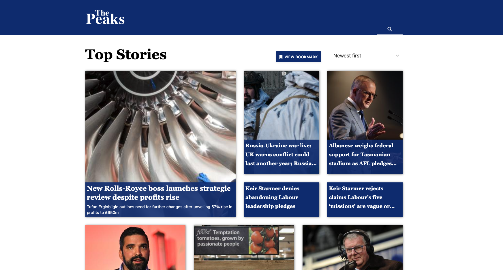

# Peaks test
[Link](https://grand-tapioca-740607.netlify.app) to live app on netlify.

## How to run the project

### Prerequisites

- npm

### Steps

- Open terminal Go to project directory.
- Install all dependancies using command `npm install`
- Run project using command `npm start`
- Done

### Design - Figma to website
[Figma](https://www.figma.com/proto/DR9f1p9nTfWgaaOcXcwLvZ/Frontend-UI-Test?node-id=0%3A2&scaling=min-zoom&page-id=0%3A1)

### Screenshot

